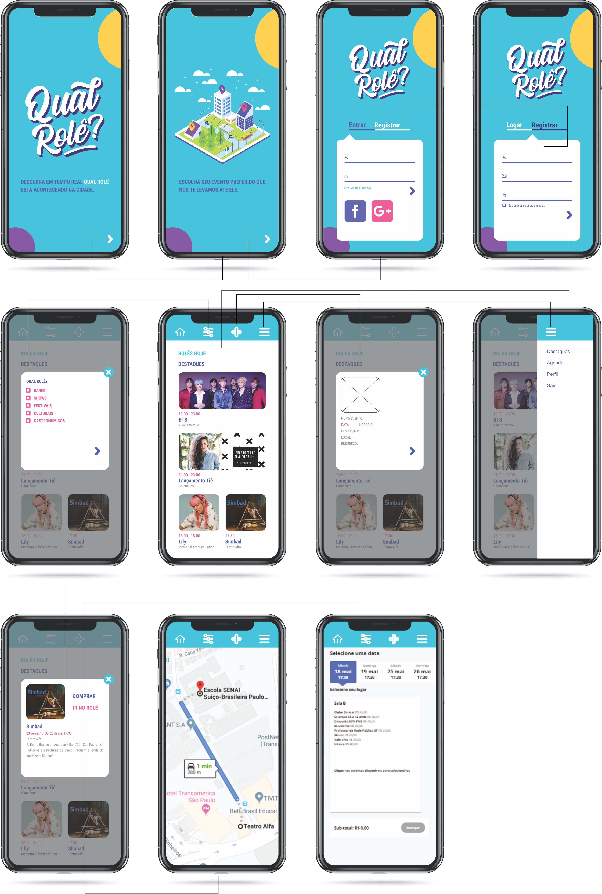

 ## PROJETO OPEN HOUSE

Aprofundamento dos conhecimentos de UX, usando APIs para criação de um projeto MVP. 

## Projeto e definição do produto
O objetivo é apresentar um site que centralize eventos de determinada região ou geolocalização em tempo real, proporcionando segurança e veracidade da informação com destaque na disponibilização do local e trajeto no  mapa, informações e contato do estabelecimento, horário do evento, taxa de conveniência ou valor da entrada. 

## Personas e definição do usuário

Mediante características de 2 personas, foi possível definir como oferecer informações seguras e estudar ferramentas diferenciadas que atenda o serviço que o usuário procura. 

##### Validação das principais necessidades do usuário:
Através de pesquisas com formulários online e visualização de comentários dos concorrentes. Usuários em potencial são pessoas entre 21 e 31 anos que gostam de interação, lugares movimentados e contato social.  Detectado as seguintes insatisfações com relação aos produtos existentes: agenda  desatualizada, categorias indefinidas, falta de eventos reunidos com opção de filtro, links diretos para eventos com ingressos, espaço de armazenamento do app, opção de marcar encontros, interface simples, idioma português, solicitação de contas específicas para logar, cadastro / compra e cancelamento das solicitações complicadas, bugs, app que funcione em todos os sistemas operacionais e inclusão de eventos diferenciados ex. meetup.

###### Pesquisa ralizada: 

##### Problemas que o produto resolve:
Validação e registro somente de eventos públicos e em ponto comercial, o que garante a segurança e veracidade da informação para que a atenda a expectativa do usuário conforme a proposta do estabelecimento.

##### Principais funcionalidades:
Assegurar a divulgação e o compartilhamento de eventos e expor características/critérios do local. 

##### Sketch do Produto:

Rascunho das telas por onde foi possível criar uma base para o desenvolvimento e fluxo da página.

##### Validação de eficiência:
Simulação do aplicativo através de protótipo de média fidelidade na ferramenta Marvel: https://marvelapp.com/725bfdb

##### Formas de incentivo para utilização do produto:
Disponibilizar layout simples, confortável e sem custo ao usuário final. Promovendo o produto por mídias sociais e propanganda através dos estabelecimentos. 

## Sobre o nome “Qual Rolê?”
A proposta é que os usuários visualize de imediato as alternativas de eventos que corresponda a sua diversão, em tempo real, que permita satisfação no escolha do rolê.

### Tecnologias usadas

* [ ] API Here
* [ ] API Firebase Firestone
* [ ] JavaScript
* [ ] JQuery
* [ ] Bootstrap

Obs. Utilizar ao menos uma API REST (ou seja, API que utiliza requisições HTTP para extrair, inserir, postar e deletar dados). Em que o request são feitos utilizando fetch (fornece uma interface ao JS para acessar e manipular partes do pipeline HTTP, como pedidos e respostas).

## Roteiro

#### versão 1.0.0 (liberado)
+ Acesso ao site pela tela de login, filtro de eventos e visualização do mapa. 
